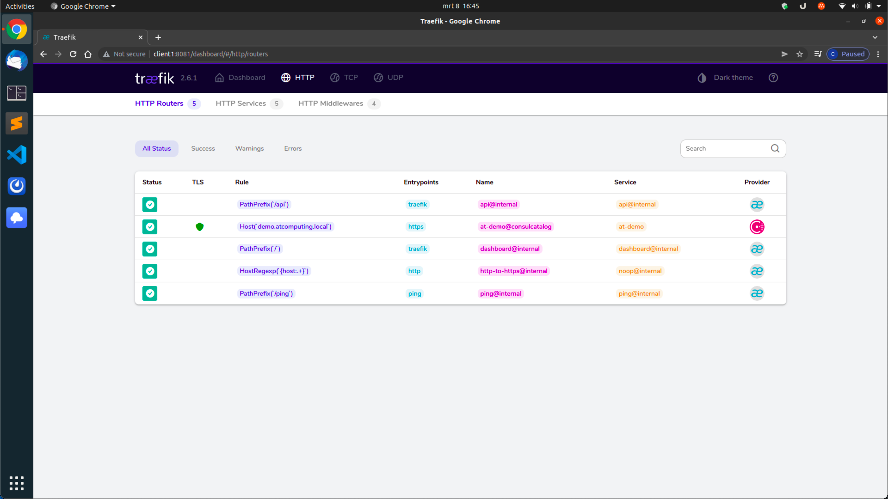

# HashiCorp Demo Environment


![Author](https://img.shields.io/badge/guru-chrisvanmeer-3399cc.svg?logo=data:image/svg+xml;base64,PD94bWwgdmVyc2lvbj0iMS4wIiBlbmNvZGluZz0iVVRGLTgiPz4KPHN2ZyB2ZXJzaW9uPSIxLjEiIHZpZXdCb3g9IjAgMCAzMiAzMiIgeG1sbnM9Imh0dHA6Ly93d3cudzMub3JnLzIwMDAvc3ZnIj4KPGRlZnM+CjxjbGlwUGF0aCBpZD0iYSI+CjxwYXRoIGQ9Im0wIDI0NS41aDM4OC44NnYtMjQ1LjVoLTM4OC44NnoiLz4KPC9jbGlwUGF0aD4KPC9kZWZzPgo8ZyB0cmFuc2Zvcm09Im1hdHJpeCguMTgxMzcgMCAwIC0uMTgxMzcgLTE4LjYzMyAzOC41OTkpIiBjbGlwLXBhdGg9InVybCgjYSkiPgo8ZyB0cmFuc2Zvcm09InRyYW5zbGF0ZSgxOTEuMjkgNDAuODcyKSI+CjxwYXRoIGQ9Im0wIDBjNDUuODU1IDAgODMuMTYyIDM3LjMwNiA4My4xNjIgODMuMTYyIDAgNDUuODU1LTM3LjMwNyA4My4xNjItODMuMTYyIDgzLjE2Mi00NS44NTQgMC04My4xNjItMzcuMzA3LTgzLjE2Mi04My4xNjIgMC00NS44NTYgMzcuMzA4LTgzLjE2MiA4My4xNjItODMuMTYyIiBmaWxsPSIjZmZmIi8+CjwvZz4KPGcgdHJhbnNmb3JtPSJ0cmFuc2xhdGUoMjAyLjI2IDEwMi40KSI+CjxwYXRoIGQ9Im0wIDAtMjguMDIzIDUyLjc4NmMxLjQxNC0yLjg0IDEuNTAyLTYuMjg4LTAuMDk5LTkuMzAzbC05LjAwMi0xNi45NiAxOS4xNDYtMzYuMDY4YzEuODMtMy40NDMgNS4zNTQtNS40MDYgOC45OTktNS40MDYgMS42MDkgMCAzLjI0MSAwLjM4NCA0Ljc2MyAxLjE5MSA0Ljk2MyAyLjYzNSA2Ljg1MSA4Ljc5NCA0LjIxNiAxMy43NiIgZmlsbD0iIzllYzllZCIvPgo8L2c+CjxnIHRyYW5zZm9ybT0idHJhbnNsYXRlKDE2MC4zNyAxNTkuNikiPgo8cGF0aCBkPSJtMCAwYzQuOTY4IDIuNjM1IDExLjEyNiAwLjc0NyAxMy43Ni00LjIxNmwwLjEwNS0wLjJjLTAuOTEzIDEuODM2LTIuMzY2IDMuNDIyLTQuMzE1IDQuNDU3LTQuOTYgMi42MzUtMTEuMTI0IDAuNzQ4LTEzLjc1OS00LjIxN2wtMjguMTI3LTUyLjk4NGMtMi42MzctNC45NjUtMC43NDgtMTEuMTI0IDQuMjE2LTEzLjc1OSAxLjUyLTAuODA5IDMuMTUzLTEuMTkxIDQuNzYzLTEuMTkxIDMuNjQ0IDAgNy4xNjkgMS45NjMgOC45OTggNS40MDZsMTkuMTIzIDM2LjAyNi04Ljk4MSAxNi45MTdjLTIuNjM2IDQuOTY0LTAuNzQ3IDExLjEyNiA0LjIxNyAxMy43NjEiIGZpbGw9IiMzMTk5Y2MiLz4KPC9nPgo8ZyB0cmFuc2Zvcm09InRyYW5zbGF0ZSgxNzQuMjMgMTU1LjE5KSI+CjxwYXRoIGQ9Im0wIDAtMC4xMDUgMC4xOTljLTIuNjM1IDQuOTYzLTguNzkzIDYuODUxLTEzLjc2MSA0LjIxNi00Ljk2NC0yLjYzNS02Ljg1Mi04Ljc5Ni00LjIxNy0xMy43Nmw4Ljk4MS0xNi45MTggOS4wMDIgMTYuOTZjMS42MDIgMy4wMTUgMS41MTMgNi40NjMgMC4xIDkuMzAzIiBmaWxsPSIjM2M2M2FkIi8+CjwvZz4KPGcgdHJhbnNmb3JtPSJ0cmFuc2xhdGUoMjQ1LjYzIDE2MC44MykiPgo8cGF0aCBkPSJtMCAwaC0xOS42ODljNS42MjEgMCAxMC4xNzctNC41NTYgMTAuMTc3LTEwLjE3N3YtMTAuMTc3aDkuNTEyYzUuNjIxIDAgMTAuMTc4IDQuNTU2IDEwLjE3OCAxMC4xNzdzLTQuNTU3IDEwLjE3Ny0xMC4xNzggMTAuMTc3IiBmaWxsPSIjMzE5OWNjIi8+CjwvZz4KPGcgdHJhbnNmb3JtPSJ0cmFuc2xhdGUoMjI1Ljk0IDE2MC44MykiPgo8cGF0aCBkPSJtMCAwaC0xOS42ODdjLTUuNjIxIDAtMTAuMTc2LTQuNTU2LTEwLjE3Ni0xMC4xNzdzNC41NTUtMTAuMTc3IDEwLjE3Ni0xMC4xNzdoOS41MTF2MTAuMTc3YzAgNS42MjEgNC41NTYgMTAuMTc3IDEwLjE3NiAxMC4xNzciIGZpbGw9IiMzMTk5Y2MiLz4KPC9nPgo8ZyB0cmFuc2Zvcm09InRyYW5zbGF0ZSgyMTUuNzYgOTcuMzY5KSI+CjxwYXRoIGQ9Im0wIDBjMC01LjYyMSA0LjU1Ni0xMC4xNzcgMTAuMTc3LTEwLjE3N3MxMC4xNzcgNC41NTYgMTAuMTc3IDEwLjE3N3Y0My4xMTFoLTIwLjM1NHoiIGZpbGw9IiMzMTk5Y2MiLz4KPC9nPgo8ZyB0cmFuc2Zvcm09InRyYW5zbGF0ZSgyMjUuOTQgMTYwLjgzKSI+CjxwYXRoIGQ9Im0wIDBjLTUuNjIgMC0xMC4xNzYtNC41NTYtMTAuMTc2LTEwLjE3N3YtMTAuMTc3aDIwLjM1NHYxMC4xNzdjMCA1LjYyMS00LjU1NyAxMC4xNzctMTAuMTc4IDEwLjE3NyIgZmlsbD0iIzNjNjNhZCIvPgo8L2c+CjwvZz4KPC9zdmc+Cg==)
  


This repository holds all the code you will need to spin up a cluster of (by default 7) virtual instances that will have a mixture of HashiCorp products installed.

All the provisioning is done through [Ansible](https://www.ansible.com). And the virtual instances are meant to be built with [Ubuntu Multipass](https://multipass.run). During the deployment, the multipass instances will be provisioned and a new inventory file will be created.

## What do the specific products do in this demo?

### Multipass

> Multipass is a CLI to launch and manage VMs on Windows, Mac and Linux that simulates a cloud environment with support for cloud-init. 

Multipass is one of the two choices you have to deploy this demo environment.

### Terraform

> Terraform is an open-source infrastructure as code software tool that enables you to safely and predictably create, change, and improve infrastructure.

Terraform is the other of the two choices you have to deploy this demo environment.

### Consul

> Consul is a service networking solution to automate network configurations, discover services, and enable secure connectivity across any cloud or runtime.

In our demo we will be using it for both the storage backend of Vault and for the service discovery within Nomad jobs.

### Vault

> Vault secures, stores, and tightly controls access to tokens, passwords, certificates, API keys, and other secrets in modern computing.

In our demo we will be storing the created SSL certificate in Vault, so that this can be accessed by Nomad during a job run.

### Nomad

> Nomad is a highly available, distributed, data-center aware cluster and application scheduler designed to support the modern datacenter with support for long-running services, batch jobs, and much more.

In this demo we will use Nomad to demonstrate the possibilities of deploying applications fault tolerant and high available. We're only scratching the surface of the possibilities of this product for this demo.

## Schematic overview

A schematic overview of what we will be building:


Basically, this is what we will achieve with this

- We'll deploy 3 servers and 4 clients.
- The servers will house:
  - Consul
  - Nomad
  - Vault
- The clients will house:
  - Consul
  - Nomad
  - Docker
- The servers will do all the thinking, the clients will do all the processing.
- We will spin up two jobs in Nomad:
  - Traefik
    - This will be the reverse proxy / load balancer for our webapp. The idea is that all the Traefik config is done on the webapp side, and Traefik will dynamically pick this up in realtime.
  - AT-Demo
    - A small PHP image that will house a logo and show the IP address and port of the client.
- We can then play around with job properties / kill clients / down- and upgrade Nomad and see what happens.

Estimated runtime to setup: 15 - 30 minutes.  
You will be needing about 8GB of RAM to run this without annoying lagg.  
Diskspace wise I would say about 5GB of diskspace should cover it.

### Disclaimer

This was built and tested on both macOS 12.1 (Intel chip) and Ubuntu 20.04 LTS Desktop.  
Running the same setup on macOS with an M1-chip will fail miserably.

## Step 1 - Install required software

Make sure you have the following installed on your workstation:

- Ansible
- Multipass
- Terraform (optional)

## Step 2 - Install Ansible requirements

```ansible
ansible-galaxy install -r requirements.yml
```

## Step 3 - Deploy the instances

You can either deploy the instances locally with Multipass, or in the AWS cloud with Terraform. You decide.  
If you want to deploy with Multipass, go for step 3a.  
If you want to deploy with Terraform, go for step 3b.  
**Beware that you must choose the one or the other, do not execute 3a AND 3b.**

### Step 3a - Multipass

#### Most noticable / important variables

| Variable             | Default value                              | Description                                                                              |
| -------------------- | ------------------------------------------ | ---------------------------------------------------------------------------------------- |
| atcomputing_user     | `atcomputing`                              | The user that will be used as admin user of on each instance.                            |
| public_key           | `~/.ssh/id_rsa.pub`                        | The public key that will be added to the `atcomputing_user` user's authorized_keys file. |
| multipass_instances  | See the multipass `main.yml` variable file | The instances that we will be using.                                                     |
| multipass_passphrase | `atcomputing`                              | The passphrase used to authenticate against Multipass.                                   |

**Please make sure you have updated your Multipass passphrase accordingly**  
Use the `multipass set local.passphrase` command.

#### Objective

This playbook will spin up the Multipass instances with the cloud-init option to create the admin user. If it detects instances with the same names as in the variable file, you will be prompted to allow for deletion of all of these instances.

After creating the Multipass instances, a new inventory is made in this directory with the name `inventory` and this will contain all of the servers and clients.

And lastly it will add the names and IP addresses to the local `/etc/hosts` file.

### Run playbook

```ansible
ansible-playbook 00_multipass-prep-inventory-and-hosts.yml
```

With the second run (you will be prompted)

```ansible
ansible-playbook 00_multipass-prep-inventory-and-hosts.yml --tags hostfile --ask-become-pass
```

### Step 3b - Terraform

#### Most noticable / important variables

| Variable   | Default value       | Description                                                                    |
| ---------- | ------------------- | ------------------------------------------------------------------------------ |
| public_key | `~/.ssh/id_rsa.pub` | The public key that will be added to the `ubuntu` user's authorized_keys file. |

#### Objective

This playbook will spin up the EC2 instances. After creating the EC2 instances, a new inventory is made in main folder with the name `inventory` and this will contain all of the servers and clients. **Please note** that the default user `ubuntu` will be used in this demo.

#### Pre-requisites

Before we can start to deploy, make sure you have your Amazon access key and secret key at hand. We will also be needing a region. You can either set them as environment variables

```bash
export AWS_REGION="eu-central-1"
export AWS_ACCESS_KEY_ID="<ACCES_KEY>"
export AWS_SECRET_ACCESS_KEY="<SECRET_KEY>"
```

Or enable the following settings in the `terraform/providers.tf`. Look for the following section. Uncomment them and fill in the correct values.

```hcl
# region     = "eu-central-1"
# access_key = "my-access-key"
# secret_key = "my-secret-key"
```

#### Overriding variables

If you look in `terraform/variables.tf` you see the variables that are used. If you for instance would like to override the `public_key` variable, then please open up the `terraform/terraform.tfvars` file and place the following in there:

```hcl
public_key="~/.ssh/some_other_id_rsa.pub"
```

#### Run playbook

```bash
cd terraform
terraform init
terraform plan
terraform apply
```

Now you will be prompted to enter your first name. This will be used as a prefix for both the EC2 instances as the generated key-pair.

## Step 4 - General server configuration

### Most noticable / important variables

| Variable                    | Default value                        | Description                                          |
| --------------------------- | ------------------------------------ | ---------------------------------------------------- |
| hashicorp_product_selection | `- consul`<br>`- nomad`<br>`- vault` | The products that will be installed.                 |
| basic_apt_packages          | See variable file                    | Add / remove packages as you please for general use. |
| token_directory             | `~/hashi-tokens`                     | This path will be used to store the tokens locally.  |

### Objective

This playbook will install all the neccesairy packages on both servers and clients.

### Run playbook

```ansible
ansible-playbook 01_general-server-configuration.yml
```

## Step 5 - (Self Signed) Public Key Infrastructure

### Most noticable / important variables

| Variable  | Default value            | Description                          |
| --------- | ------------------------ | ------------------------------------ |
| demo_fqdn | `demo.atcomputing.local` | The demo FQDN that we will be using. |

### Objective

This playbook will do the following:

- Create a self-signed Certificate Authority on the first server.
- Copy the CA certificate over to the rest of the environment.
- Each server and client will do a certificate request to the first server.
- The first server will issue the certificates and stores them on the servers / clients.
- A certificate for the demo webapp will be requested and issued.
- This certificate will be placed in Vault later on, so that Traefik (see Nomad Demo Jobs) can use it as an artifact.

### Run playbook

```ansible
ansible-playbook 02_public-key-infrastructure.yml
```

## Step 6 - Consul deployment

### Most noticable / important variables

| Variable                          | Default value                              | Description                                                                                                               |
| --------------------------------- | ------------------------------------------ | ------------------------------------------------------------------------------------------------------------------------- |
| hashicorp_datacenter_name         | `velp`                                     | This datacenter name will be used in both Consul as Nomad (and in the demo jobs).                                         |
| consul_bootstrap_token_local_path | `~/hashi-tokens/management.consul.token`   | After bootstrapping, this will be saved to the local workstation at this location. **Don't loose this file!**             |
| consul_dns_token_local_path       | `~/hashi-tokens/dns-requests.consul.token` | This token will be used to register the Consul agents with, to keep allowing for DNS requests even though ACL is enabled. |

### Objective

This playbook will configure a Consul cluster, where the servers will be running the Consul agent in server-mode and the clients will be running the Consul agent in client-mode.

The Consul agent listens on both server and client on TCP port 8200. The servers will have the UI enabled.

After this playbook you should be able to reach the UI through `http://server1:8500` from your local workstation.

### Run playbook

```ansible
ansible-playbook 03_consul-deployment.yml
```

### Screenshot(s)


## Step 7 - Vault deployment

### Most noticable / important variables

| Variable                        | Default value                               | Description                                                                                                   |
| ------------------------------- | ------------------------------------------- | ------------------------------------------------------------------------------------------------------------- |
| vault_bootstrap_init_local_path | `~/hashi-tokens/vault.master.keys`          | After bootstrapping, this will be saved to the local workstation at this location. **Don't loose this file!** |
| vault_admin_local_path          | `~/hashi-tokens/atcomputing.vault.password` | After bootstrapping, this will be saved to the local workstation at this location. **Don't loose this file!** |

### Objective

This playbook will configure a Vault cluster, where the servers will be running the Vault agent in server mode. The clients will have the Vault agent installed for use as a client. Consul will be used for the storage the Vault backend because this makes the whole storage high available.

The Vault agent listens on TCP port 8200.

After this playbook you should be able to reach the UI through `https://server1:8200` or `https://vault.atcomputing.local` from your local workstation.

### Screenshot(s)


### Run playbook

```ansible
ansible-playbook 04_vault-deployment.yml
```

## Step 8 - Nomad deployment

### Most noticable / important variables

| Variable                         | Default value                                     | Description                                                                                                   |
| -------------------------------- | ------------------------------------------------- | ------------------------------------------------------------------------------------------------------------- |
| hashicorp_datacenter_name        | `velp`                                            | This datacenter name will be used in both Consul as Nomad (and in the demo jobs).                             |
| nomad_bootstrap_token_local_path | `~/hashi-tokens/management.nomad.token`           | After bootstrapping, this will be saved to the local workstation at this location. **Don't loose this file!** |
| nomad_operator_token_local_path  | `~/hashi-tokens/atcomputing-operator.nomad.token` | After bootstrapping, this will be saved to the local workstation at this location. **Don't loose this file!** |

### Objective

This playbook will configure a Nomad cluster, where the servers will be running the Nomad agent in server-mode and the clients will be running the Nomad agent in client-mode.

The Nomad agent listens on both server and client on TCP port 4646. The servers will have the UI enabled.

After this playbook you should be able to reach the UI through `http://server1:4646` from your local workstation.

### Run playbook

```ansible
ansible-playbook 05_nomad-deployment.yml
```

### Screenshot(s)


## Step 9 - Nomad / Vault integration

### Most noticable / important variables

None

### Objective

This playbook create Vault policies, roles and tokens for Nomad servers to use to be able to retrieve secrets. In our case, the created SSL certificate for the webapp.

### Run playbook

```ansible
ansible-playbook 06_nomad-vault-integration.yml
```

## Step 10 - Nomad demo jobs

### Most noticable / important variables

| Variable                  | Default value            | Description                                                                                                                      |
| ------------------------- | ------------------------ | -------------------------------------------------------------------------------------------------------------------------------- |
| traefik_demo_docker_image | `traefik:v2.6`           | The version of Traefik we will be using. Be sure to stick to a v2 version, otherwise all config will be useless.                 |
| at_demo_group_count       | `3`                      | The number of instances of the webapp that will be deployed and allocated. You can step up this number to create more instances. |
| at_demo_env_favicon       | AT Computing favicon URL | The favicon that will be shown.                                                                                                  |
| at_demo_env_img_source    | AT Computing logo URL    | The image / logo that will be shown.                                                                                             |

### Objective

This playbook will deploy to and run two jobs on Nomad:

- Traefik
  - Will be placed on `client1` for demo purposes. The local `/etc/hosts` file will also have an entry for the demo FQDN that will point to this instance.
  - Traefik is subscribed to the Consul catalog, so other jobs can hook into Consul by the use of Traefik tags.
  - Traefik will be listening on TCP port 80 and 443 for web traffic and on TCP port 8081 for the API (with dashboard enabled).
- AT-Demo
  - Will be placed on any client but `client1`. This is done so we can kill clients / upgrade clients without disrupting the Traefik instance, so we can test the high availability / migration.
  - The PHP docker image that will be used for testing.
  - The exposed docker port will be dynamic, and will be picked up by Consul and thus Traefik for the connection. The local port is port 80.
  - The jobs will also be placed on `server1` on `/opt/nomad/demo-jobs`.

After this playbook you should be able to reach the Traefik UI through `http://client1:8081` from your local workstation.

And you should be able to reach the AT-Demo webapp through `https://demo.atcomputing.local` from your local workstation (HTTP to HTTPS redirection is enabled as well).

### Run playbook

```ansible
ansible-playbook 07_nomad-demo-jobs.yml
```

### Screenshot(s)





### Job files - rendered

#### Traefik `traefik.nomad`

```hcl
variables {
  custom_certs = ["webapp"]
  default_cert = ["webapp"]
}

job "traefik" {
  datacenters = ["velp"]
  type        = "service"

  // For demo purposes, keep this job on the first client.
  constraint {
    attribute = "${node.unique.id}"
    operator  = "="
    value     = "85463edb-669f-bab2-5815-6292b78026c4"
  }

  group "traefik" {
    count = 1

    network {
      port "http" {
        static = 80
      }

      port "https" {
        static = 443
      }

      port "traefik" {
        static = 8081
      }

      port "health" {
        static = 8082
      }
    }

    service {
      name = "traefik"

      check {
        type     = "http"
        path     = "/ping"
        port     = "health"
        interval = "10s"
        timeout  = "2s"
      }
    }

    task "traefik" {

      template {
        destination = "local/traefik.yml"
        data = <<-EOH
        entryPoints:
          http:
            address: :80
            http:
              redirections:
                entryPoint:
                  to: https
                  scheme: https
                  permanent: true
          https:
            address: :443
            http:
              middlewares:
                - hsts@file
              tls: {}
          traefik:
            address: :8081
          ping:
            address: :8082
        tls:
          options:
            default:
              sniStrict: true
              minVersion: VersionTLS12
        api:
          dashboard: true
          insecure: true
        pilot:
          dashboard: false
        providers:
          file:
            directory: /local/rules
            watch: true
          consulCatalog:
            prefix: traefik
            exposedByDefault: false
            endpoint:
              address: 127.0.0.1:8500
              scheme: http
        ping:
          entryPoint: ping
        log:
          format: json
        accessLog:
          format: json
        EOH
      }

      template {
        destination = "local/rules/sts.yml"
        data = <<-EOH
        http:
          middlewares:
            hsts:
              headers:
                stsSeconds: 63072000
                stsIncludeSubdomains: true
                stsPreload: true
        EOH
      }

      dynamic "template" {
        for_each = var.default_cert
        content {
          destination = "local/rules/default_cert.yml"
          env = false
          change_mode = "noop"
          data = <<-EOH
          tls:
            stores:
              default:
                defaultCertificate:
                  certFile: /etc/traefik/ssl/${template.value}.crt
                  keyFile: /etc/traefik/ssl/${template.value}.key
          EOH
        }
      }

      dynamic "template" {
        for_each = var.custom_certs
        content {
          destination = "local/rules/${template.value}.yml"
          env = false
          change_mode = "noop"
          data = <<-EOH
          tls:
            certificates:
              - certFile: /etc/traefik/ssl/${template.value}.crt
                keyFile: /etc/traefik/ssl/${template.value}.key
          EOH
        }
      }

      dynamic "template" {
        for_each = var.custom_certs
        content {
          destination = "local/ssl/${template.value}.crt"
          env = false
          change_mode = "noop"
          left_delimiter = "{!"
          right_delimiter = "!}"
          data = <<-EOH
          {!- with secret "secret/ssl-certificates/${template.value}" -!}
          {!.Data.data.certificate!}
          {!- end -!}
          EOH
        }
      }

      dynamic "template" {
        for_each = var.custom_certs
        content {
          destination = "local/ssl/${template.value}.key"
          env = false
          change_mode = "noop"
          left_delimiter = "{!"
          right_delimiter = "!}"
          data = <<-EOH
          {!- with secret "secret/ssl-certificates/${template.value}" -!}
          {!.Data.data.privatekey!}
          {!- end -!}
          EOH
        }
      }

      vault {
        policies      = ["ssl-certificates-policy"]
        change_mode   = "signal"
        change_signal = "SIGHUP"
      }

      driver = "docker"
      config {
        image        = "{{ traefik_demo_docker_image }}"
        network_mode = "host"

        volumes = [
          "local/traefik.yml:/etc/traefik/traefik.yml",
          "local/ssl:/etc/traefik/ssl",
        ]
      }

      resources {
        cpu    = 100
        memory = 128
      }

    }

  }

}
```

#### AT-Demo `at-demo.nomad`

```hcl
job "at-demo" {
  datacenters = ["velp"]
  type        = "service"

  // For demo purposes only, spread over all but first client.
  constraint {
    attribute = "${node.unique.id}"
    operator  = "!="
    value     = "85463edb-669f-bab2-5815-6292b78026c4"
  }

  group "at-demo" {
    count = 3

    network {
      port "at-http" {
        to = 80
      }
    }

    service {
      name = "at-demo"
      port = "at-http"

      tags = [
        "traefik.enable=true",
        "traefik.http.routers.at-demo.entrypoints=https",
        "traefik.http.routers.at-demo.rule=Host(`demo.atcomputing.local`)",
      ]

      check {
        name     = "check if demo is alive"
        type     = "http"
        path     = "/"
        interval = "10s"
        timeout  = "2s"
      }

    }

    task "at-demo" {

      env {
        NODE_IP     = "${NOMAD_IP_at-http}"
        HOST_PORT   = "${NOMAD_HOST_PORT_at-http}"
        MAPPED_PORT = "${NOMAD_PORT_at-http}"
      }

      driver = "docker"
      config {
        image      = "ghcr.io/chrisvanmeer/at-image:latest"
        ports      = ["at-http"]
        force_pull = true
      }

      resources {
        cpu    = 100
        memory = 50
      }

    }

  }

}
```

### AT-Demo `Dockerfile`

```docker
FROM jamesbrink/php
COPY src/. /var/www/localhost/htdocs/
```

### AT-Demo `index.php`

```php
<?php
$node_ip     = getenv('NODE_IP') ?? "127.0.0.1";
$host_port   = getenv('HOST_PORT') ?? "0";
$mapped_port = getenv('MAPPED_PORT') ?? "0";
?>
<!DOCTYPE html>
<html lang="en">

<head>
  <meta charset="UTF-8">
  <meta http-equiv="X-UA-Compatible" content="IE=edge">
  <meta name="viewport" content="width=device-width, initial-scale=1.0">
  <title>AT HashiCorp Demo</title>
  <link rel="shortcut icon" href="https://www.atcomputing.nl/assets/img/favicon.png" type="image/x-icon">
  <link href="https://cdn.jsdelivr.net/npm/bootstrap@5.1.3/dist/css/bootstrap.min.css" rel="stylesheet" integrity="sha384-1BmE4kWBq78iYhFldvKuhfTAU6auU8tT94WrHftjDbrCEXSU1oBoqyl2QvZ6jIW3" crossorigin="anonymous">
  <link rel="stylesheet" href="style.css">
</head>

<body>
  <div class="container-fluid bg">
    <div class="display-6 fw-bold text-white text-center w-75 info">
      <div class="border-bottom mb-4">Information of the instance:</div>
      <div class="details">
        <div class="row">
          <div class="col-6 text-end">Node IP:</div>
          <div class="col-6 text-start results"><?= $node_ip ?></div>
        </div>
        <div class="row">
          <div class="col-6 text-end">Host port:</div>
          <div class="col-6 text-start results"><?= $host_port ?></div>
        </div>
        <div class="row">
          <div class="col-6 text-end">Mapped port:</div>
          <div class="col-6 text-start results"><?= $mapped_port ?></div>
        </div>
      </div>
    </div>
  </div>
</body>

</html>
```

## Optional playbooks

## Step 11 - Unseal Vault

### Most noticable / important variables

None

### Objective

This playbook will unseal the vault after a service restart / server reboot.

After this playbook you should be able to reach the UI through `https://server1:8200` or `https://vault.atcomputing.local` from your local workstation.

### Run playbook

```ansible
ansible-playbook 97_vault-unseal.yml
```

### Step 12 - Reset environment

#### Most noticable / important variables

None

#### Objective

This playbook can be run to clean up the whole HashiCorp install base from the environment. This can either be done for the whole installed stack or selectively.

If you want to use it selectively, run the playbook with the `--list-tags` argument to see which tags are available.

The binaries will **not** be deleted, but all the configuration work will be.

After this playbook you can re-run one or more of the previous playbooks to re-configure that part of the environment.

#### Run playbook

```ansible
ansible-playbook 98_reset-environment.yml
```

Example of running it selectively for just Vault

```ansible
ansible-playbook 98_reset-environment.yml --tags vault
```

### Step 13 - Destroy environment

#### Most noticable / important variables

None

#### Objective

Are you done with the environment and would you like to cleanup the whole lot? This playbook will do the following:

- Remove all the instances from the local `/etc/hosts` file.
- Delete all deployed instances.
- Deletion of the `inventory` file in this directory.

#### Run playbook

```ansible
ansible-playbook 99_destroy-environment.yml --ask-become-pass
```

If you used Terraform, then perform the following to destroy the EC2 instances, remove the keygen and remove the inventory file.

```bash
cd terraform
terraform destroy
```

## License

MIT - Copyright (c) 2022 Chris van Meer
