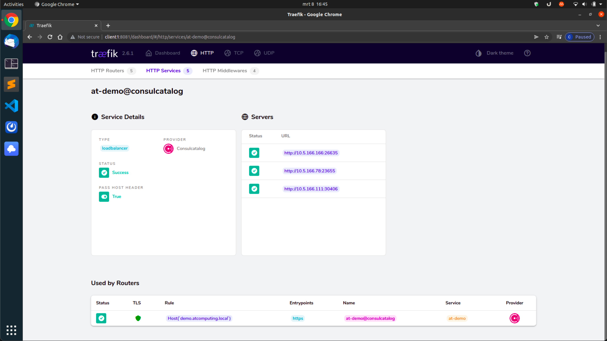

# HashiCorp Demo Environment
This repository holds all the code you will need to spin up a cluster of (by default 7) virtual instances that will have a mixture of HashiCorp products installed.

All the provisioning is done through [Ansible](https://www.ansible.com). And the virtual instances are meant to be built with [Ubuntu Multipass](https://multipass.run). During the deployment, the multipass instances will be provisioned and a new inventory file will be created.

## What do the specific products do in this demo?

#### Consul
> Consul is a service networking solution to automate network configurations, discover services, and enable secure connectivity across any cloud or runtime.

In our demo we will be using it for both the storage backend of Vault and for the service discovery within Nomad jobs.

#### Vault

> Vault secures, stores, and tightly controls access to tokens, passwords, certificates, API keys, and other secrets in modern computing.

In a future iteration of this demo, we will use Vault to store tokens for both accessing and bootstrapping Nomad.

#### Nomad

> Nomad is a highly available, distributed, data-center aware cluster and application scheduler designed to support the modern datacenter with support for long-running services, batch jobs, and much more.

In this demo we will use Nomad to demonstrate the possibilities of deploying applications fault tolerant and high available. We're only scratching the surface of the possibilities of this product for this demo.

## Schematic overview

A schematic overview of what we will be building:


Basically, this is what we will achieve with this
- We'll deploy 3 servers and 4 clients.
- The servers will house:
  - Consul
  - Nomad
  - Vault
- The clients will house:
  - Consul
  - Nomad
  - Docker
- The servers will do all the thinking, the clients will do all the processing.
- We will spin up two jobs in Nomad:
  - Traefik
    - This will be the reverse proxy / load balancer for our webapp. The idea is that all the Traefik config is done on the webapp side, and Traefik will dynamically pick this up in realtime.
  - AT-Demo
    - A small PHP image that will house a logo and show the IP address and port of the client.
- We can then play around with job properties / kill clients / down- and upgrade Nomad and see what happens.

Estimated runtime to setup: 15 - 30 minutes.  
You will be needing about 8Gb of RAM to run this without annoying lagg.  
Diskspace wise I would say about 5Gb of diskspace should cover it.

#### Disclaimer
This was built and tested on both macOS 12.1 (Intel chip) and Ubuntu 20.04 LTS Desktop.  
Running the same setup on macOS with an M1-chip will fail miserably.

## Step 1 - Install required software
Make sure you have the following installed on your workstation:
- Ansible
- Multipass

## Step 2 - Install Ansible requirements
```ansible
ansible-galaxy install -r requirements.yml
```

## Step 3 - Provisioning the Multipass instances and populate the inventory file.

### Most noticable / important variables
| Variable         | Default value            | Description                                                                                                                 |
|------------------|--------------------------|-----------------------------------------------------------------------------------------------------------------------------|
| atcomputing_user | `atcomputing`            | The user that will be used as admin user of on each instance.                                                               |
| public_key       | `~/.ssh/id_rsa.pub`      | The public key that will be added to the `atcomputing_user` user's authorized_keys file.                                    |
| demo_fqdn        | `demo.atcomputing.local` | The demo FQD N that we will be using. If you divert from this, the provided self signed certificates won't work as planned. |
| multipass_instances | See the multipass `main.yml` variable file | The instances that we will be using.

### Objective
This playbook will spin up the Multipass instances with the cloud-init option to create the admin user. If it detects instances with the same names as in the variable file, you will be prompted to allow for deletion of all of these instances.  
  
After creating the Multipass instances, a new inventory is made in this directory with the name `inventory` and this will contain all of the servers and clients.  
  
And lastly it will add the names and IP addresses to the local `/etc/hosts` file.

### Run playbook
```ansible
ansible-playbook 00_prep-inventory-and-hosts.yml
```
With the second run (you will be prompted)
```ansible
ansible-playbook 00_prep-inventory-and-hosts.yml --tags hostfile --ask-become-pass
```

## Step 4 - General server configuration

### Most noticable / important variables
| Variable                    | Default value                                          | Description                                          |
|-----------------------------|--------------------------------------------------------|------------------------------------------------------|
| hashicorp_product_selection | `- consul`<br>`- nomad=1.2.3`<sup>*</sup><br>`- vault` | The products that will be installed.                 |
| basic_apt_packages          | See variable file                                      | Add / remove packages as you please for general use. |
  
<sup>* Sticking to version 1.2.3 for now, since I ran into an artifact bug in version 1.2.4.</sup>
  
### Objective
This playbook will install all the neccesairy packages on both servers and clients.

### Run playbook
```ansible
ansible-playbook 01_general-server-configuration.yml
```

## Step 5 - Consul deployment

### Most noticable / important variables
| Variable                          | Default value                      | Description                                                                                                   |
|-----------------------------------|------------------------------------|---------------------------------------------------------------------------------------------------------------|
| hashicorp_datacenter_name         | `velp`                             | This datacenter name will be used in both Consul as Nomad (and in the demo jobs).                             |
| consul_bootstrap_token_local_path | `~/server1.consul.bootstrap.token` | After bootstrapping, this will be saved to the local workstation at this location. **Don't loose this file!** |

### Objective
This playbook will configure a Consul cluster, where the servers will be running the Consul agent in server-mode and the clients will be running the Consul agent in client-mode.  
  
The Consul agent listens on both server and client on TCP port 8200. The servers will have the UI enabled.  
  
After this playbook you should be able to reach the UI through `http://server1:8200` from your local workstation.

### Run playbook
```ansible
ansible-playbook 02_consul-deployment.yml
```

### Screenshot(s)
  
  
  
  


## Step 6 - Vault deployment

### Most noticable / important variables
| Variable                         | Default value                     | Description                                                                                                   |
|----------------------------------|-----------------------------------|---------------------------------------------------------------------------------------------------------------|
| vault_bootstrap_token_local_path | `~/server1.vault.bootstrap.token` | After bootstrapping, this will be saved to the local workstation at this location. **Don't loose this file!** |
| vault_bootstrap_init_local_path  | `~/server1.vault.bootstrap.init`  | After bootstrapping, this will be saved to the local workstation at this location. **Don't loose this file!** |

### Objective
This playbook will configure a Vault cluster, where the servers will be running the Vault agent in server mode. Consul will be used for the storage of all secrets.  
  
The Vault agent listens on TCP port 8500.

### Run playbook
```ansible
ansible-playbook 03_vault-deployment.yml
```

## Step 7 - Unseal Vault

### Most noticable / important variables
None

### Objective
This playbook will unseal the vault after creating the cluster and you can also use this playbook to unseal the vault after a service restart / server reboot.  
  
After this playbook you should be able to reach the UI through `http://server1:8500` from your local workstation.

### Screenshot(s)
  
  


### Run playbook
```
ansible-playbook 04_vault-unseal.yml
```

## Step 8 - Nomad deployment

### Most noticable / important variables
| Variable                         | Default value                     | Description                                                                                                   |
|----------------------------------|-----------------------------------|---------------------------------------------------------------------------------------------------------------|
| hashicorp_datacenter_name        | `velp`                            | This datacenter name will be used in both Consul as Nomad (and in the demo jobs).                             |
| nomad_bootstrap_token_local_path | `~/server1.nomad.bootstrap.token` | After bootstrapping, this will be saved to the local workstation at this location. **Don't loose this file!** |
| nomad_use_bootstrap              | `true`                            | Whether or not we will bootstrap the system (aka use encryption).                                             |

### Objective
This playbook will configure a Nomad cluster, where the servers will be running the Nomad agent in server-mode and the clients will be running the Nomad agent in client-mode.  
  
The Nomad agent listens on both server and client on TCP port 4646. The servers will have the UI enabled.  
  
After this playbook you should be able to reach the UI through `http://server1:4646` from your local workstation.

### Run playbook
```ansible
ansible-playbook 05_nomad-deployment.yml
```
### Screenshot(s)
  
  
  
  
  
  
  
  


## Step 9 - Nomad demo jobs

### Most noticable / important variables
| Variable                  | Default value            | Description                                                                                                                      |
|---------------------------|--------------------------|----------------------------------------------------------------------------------------------------------------------------------|
| traefik_demo_docker_image | `traefik:v2.6`           | The version of Traefik we will be using. Be sure to stick to a v2 version, otherwise all config will be useless.                 |
| at_demo_group_count       | `3`                      | The number of instances of the webapp that will be deployed and allocated. You can step up this number to create more instances. |
| at_demo_env_favicon       | AT Computing favicon URL | The favicon that will be shown.                                                                                                  |
| at_demo_env_img_source    | AT Computing logo URL    | The image / logo that will be shown.                                                                                             |

### Objective
This playbook will deploy to and run two jobs on Nomad:
- Traefik
  - Will be placed on `client1` for demo purposes. The local `/etc/hosts` file will also have an entry for the demo FQDN that will point to this instance.
  - Traefik is subscribed to the Consul catalog, so other jobs can hook into Consul by the use of Traefik tags.
  - Traefik will be listening on TCP port 80 and 443 for web traffic and on TCP port 8081 for the API (with dashboard enabled).
- AT-Demo
  - Will be placed on any client but `client1`. This is done so we can kill clients / upgrade clients without disrupting the Traefik instance, so we can test the high availability / migration.
  - The PHP docker image that will be used for testing.
  - The exposed docker port will be dynamic, and will be picked up by Consul and thus Traefik for the connection. The local port is port 80.
  - The jobs will also be placed on `server1` on `/opt/nomad/demo-jobs`.
  
It will also add the self signed CA certificate file (of `atcomputing.local`) to the trusted CA store.  
  
After this playbook you should be able to reach the Traefik UI through `http://client1:8081` from your local workstation.  
  
And you should be able to reach the AT-Demo webapp through `https://demo.atcomputing.local` from your local workstation (HTTP to HTTPS redirection is enabled as well).

### Run playbook
```ansible
ansible-playbook 06_nomad-demo-jobs.yml
```
### Screenshot(s)
  
  
  
  
  
  
  
  
  
  
  
  


### Job files - rendered

#### Traefik `traefik.nomad`
```hcl
job "traefik" {
  datacenters = ["velp"]
  type        = "service"

  // For demo purposes, keep this job on the first client.
  constraint {
    attribute = "${node.unique.id}"
    operator  = "="
    value     = "85463edb-669f-bab2-5815-6292b78026c4"
  }

  group "traefik" {
    count = 1

    network {
      port "http" {
        static = 80
      }

      port "https" {
        static = 443
      }

      port "api" {
        static = 8081
      }
    }

    service {
      name = "traefik"

      check {
        name     = "alive"
        type     = "tcp"
        port     = "http"
        interval = "10s"
        timeout  = "2s"
      }
    }

    task "traefik" {

      driver = "docker"
      config {
        image        = "traefik:v2.6"
        network_mode = "host"

        volumes = [
          "local/traefik.toml:/etc/traefik/traefik.toml",
          "local/ssl:/etc/traefik/ssl",
        ]
      }

      artifact {
        source = "https://raw.githubusercontent.com/chrisvanmeer/at-image/main/demo.atcomputing.local-cert.pem"
        destination = "local/ssl/tls.crt"
        mode = "file"
      }

      artifact {
        source = "https://raw.githubusercontent.com/chrisvanmeer/at-image/main/demo.atcomputing.local-key.pem"
        destination = "local/ssl/tls.key"
        mode = "file"
      }

      template {
        data = <<EOF
[entryPoints]
  [entryPoints.http]
    address = ":80"
  [entryPoints.https]
    address = ":443"
  [entryPoints.traefik]
    address = ":8081"

[api]
  dashboard = true
  insecure  = true

# Enable Consul Catalog configuration backend.
[providers.consulCatalog]
  prefix           = "traefik"
  exposedByDefault = false

  [providers.consulCatalog.endpoint]
    address = "127.0.0.1:8500"
    scheme  = "http"

# Dynamic rules go hashicorp_datacenter_name
[providers.file]
  directory = "/local/rules"
  watch = true

EOF

        destination = "local/traefik.toml"
      }

      template {
        data = <<EOF
tls:
  certificates:
    - certFile: /etc/traefik/ssl/tls.crt
      keyFile: /etc/traefik/ssl/tls.key
EOF
        destination = "local/rules/ssl.yml"
      }

      resources {
        cpu    = 100
        memory = 128
      }

    }

  }

}
```

#### AT-Demo `at-demo.nomad`
```hcl
job "at-demo" {
  datacenters = ["velp"]
  type        = "service"

  // For demo purposes only, spread over all but first client.
  constraint {
    attribute = "${node.unique.id}"
    operator  = "!="
    value     = "85463edb-669f-bab2-5815-6292b78026c4"
  }

  group "at-demo" {
    count = 3

    network {
      port "at-http" {
        to = 80
      }
    }

    service {
      name = "at-demo"
      port = "at-http"

      tags = [
        "traefik.enable=true",
        "traefik.http.middlewares.redirect-to-https.redirectscheme.scheme=https",
        "traefik.http.routers.at-demo-redirect.rule=Host(`demo.atcomputing.local`)",
        "traefik.http.routers.at-demo-redirect.entrypoints=http",
        "traefik.http.routers.at-demo-redirect.middlewares=redirect-to-https",
        "traefik.http.routers.at-demo.tls=true",
        "traefik.http.routers.at-demo.entrypoints=https",
        "traefik.http.routers.at-demo.rule=Host(`demo.atcomputing.local`)",
      ]

      check {
        name     = "check if demo is alive"
        type     = "http"
        path     = "/"
        interval = "10s"
        timeout  = "2s"
      }

    }

    task "at-demo" {

      env {
        PORT       = "${NOMAD_PORT_at-http}"
        NODE_IP    = "${NOMAD_IP_at-http}"
        FAVICON    = "https://www.atcomputing.nl/assets/img/favicon.png"
        IMG_SOURCE = "https://www.atcomputing.nl/assets/img/atcomputing_white.png"
      }

      driver = "docker"
      config {
        load  = "at-image.tar"
        image = "at-image:latest"
        ports = ["at-http"]
      }

      artifact {
        source = "https://github.com/chrisvanmeer/at-image/raw/main/at-image.tar"
      }

      resources {
        cpu    = 100
        memory = 50
      }

    }

  }

}
```

### AT-Demo `Dockerfile`
```docker
FROM jamesbrink/php
COPY index.php /var/www/localhost/htdocs/
```

### AT-Demo `index.php`
```php
<?php
$favicon    = getenv("FAVICON") ?? "https://www.atcomputing.nl/assets/img/favicon.png";
$img_source = getenv("IMG_SOURCE") ?? "https://www.atcomputing.nl/assets/img/atcomputing_white.png";
$port       = getenv('PORT') ?? "0";
$node_ip    = getenv('NODE_IP') ?? "127.0.0.1";
?>
<!DOCTYPE html>
<html>

<head>
  <link rel="shortcut icon" type="image/x-icon" href="/<?= $favicon ?>" />
  <title>AT HashiCorp Demo</title>
  <style type="text/css">
  div {
    display: flex;
    justify-content: center;
    vertical-align: middle;
  }

  img {
    width: 640px;
    margin-top: 15%;
  }

  p {
    font-family: "Segoe UI", Tahoma, Geneva, Verdana, sans-serif;
    text-align: center;
    font-size: 2rem;
  }
  </style>
</head>

<body>
  <div>
    ">
  </div>
  <div>
    <p>Running on host: <?= $node_ip ?> on port <?= $port ?>
    <p>
  </div>

</body>

</html>
```

## Step 10 - Reset environment

### Most noticable / important variables
None

### Objective
This playbook can be run to clean up the whole HashiCorp install base from the environment. This can either be done for the whole installed stack or selectively.  
  
If you want to use it selectively, run the playbook with the `--list-tags` argument to see which tags are available.  
  
The binaries will **not** be deleted, but all the configuration work will be.  
  
After this playbook you can re-run one or more of the previous playbooks to re-configure that part of the environment.

### Run playbook
```ansible
ansible-playbook 98_reset-environment.yml
```
Example of running it selectively for just Vault
```ansible
ansible-playbook 98_reset-environment.yml --tags vault
```

## Step 11 - Destroy environment

### Most noticable / important variables
None

### Objective
Are you done with the environment and would you like to cleanup the whole lot? This playbook will do the following:
- Remove all the instances from the local `/etc/hosts` file.
- Remove the self signed CA certificate from the local trusted CA store.
- Delete all Multipass instances.
- Deletion of the `inventory` file in this directory.

### Run playbook
```ansible
ansible-playbook 99_destroy-environment.yml --ask-become-pass
```

## License
MIT - Copyright (c) 2022 Chris van Meer
